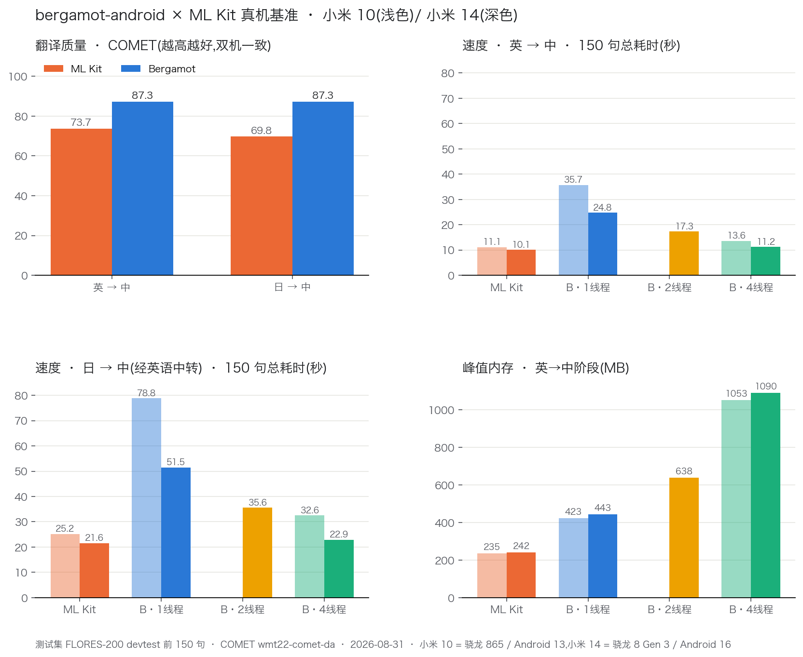

# bergamot-android

Android 离线神经机器翻译库。把 [Bergamot](https://browser.mt/) 引擎——
Firefox 内置整页翻译背后的同一套引擎——打包成 Android 库(AAR),
搭配 Mozilla 官方翻译模型,推理完全在设备端完成。

## 基准测试

两台真机 × 两种翻译方案的完整实测(测试集 FLORES-200 devtest 前
150 句,质量为 COMET `wmt22-comet-da` × 100,越高越好):



| 方向 | ML Kit | Bergamot |
|---|---|---|
| 英 → 中 COMET | 73.7 | **87.3** |
| 日 → 中 COMET | 69.8 | **87.3** |

读法:

- **质量**:Bergamot 领先 13.5–17.5 分,跨机型、跨线程数完全一致;
  日→中双方都经英语中转,Bergamot 用引擎内建 pivot。
- **速度**:旗舰(8 Gen 3)上 4 线程 Bergamot 两个方向均不慢于
  ML Kit;2 线程是质量/速度/内存的甜点位。
- **内存**:每个 worker 各持一份计算图,随线程数近似线性;模型空闲
  自动卸载。低内存设备可用 1 线程 + 顺序 pivot(峰值只保留一个模型)。
- 复现:`sample/` 基准 app 一键跑出同款 JSON(含每阶段内存/CPU 曲线),
  命令见下文;质量评分在主机侧用 COMET 对照 FLORES 参考译文完成。

## 仓库结构

```
engine/        Bergamot 引擎,vendor 自 mozilla/translations(来源与升级手顺见 engine/UPSTREAM.md)
patches/       对上游的全部本地改动,git 补丁形式存档
jni/           C++ 胶水层:批量进出,走 AsyncService
bergamot/      Android 库(Kotlin suspend API)→ AAR
tools/smoke    主机端 CLI,供 CI / 开发做正确性与性能冒烟(不随库发布)
sample/        基准测试 app:ML Kit vs Bergamot,内存/CPU 曲线,JSON 导出
registry.json  Mozilla 模型下载索引(每个方向的 URL / sha256 / 大小)
```

## 用法

```kotlin
val engine = BergamotEngine(EngineConfig(threads = 2))
val model = ModelFiles.fromDirectory(File(modelsDir, "enzh"))
val translated: List<String> = engine.translate(texts, model)          // suspend
// 日→中经英语中转,两个模型常驻:
engine.translatePivot(texts, jaEn, enZh)
engine.releaseAllModels()   // 例如挂在 onTrimMemory
```

模型使用 Mozilla 的 Firefox 翻译模型(MPL-2.0):按 `registry.json`
把对应方向的文件下载到一个目录即可。**每个进程只能创建一个
`BergamotEngine`**(底层 marian 运行时持有进程级全局状态)。

## 构建

仅支持 ARM 主机(Apple Silicon / ARM Linux)——x86 GEMM 后端刻意未
vendor。依赖:JDK 17、Android SDK(NDK r29、CMake 3.31,钉定版本见
`bergamot/build.gradle.kts`)。

```bash
./gradlew :bergamot:assembleRelease          # AAR
./gradlew :sample:assembleDebug              # 基准 app
cmake -B build-host -DCMAKE_BUILD_TYPE=Release -DSSPLIT_USE_INTERNAL_PCRE2=ON \
  -DCOMPILE_TESTS=OFF && cmake --build build-host --target smoke   # 主机 CLI
```

真机一键基准(结果写入 app files 目录的 JSON,含每阶段内存/CPU 曲线):

```bash
adb shell am start -n io.github.yinvoker.bergamot.bench/.MainActivity \
  --ez autorun true --ei threads 2
```

## 范围与限制

- 仅 arm64-v8a,minSdk 28,支持 16 KB page size。
- int8 矩阵乘在支持 dotprod 的 CPU 上走 ruy 的 SDOT 内核(运行时分发;
  cpuinfo 检测失败时回落到操作系统层检测)。
- worker 并行按份数放大内存:每个 worker 一份计算图,手机上 1–2 个
  worker 是合理区间。
- HTML 感知翻译已接通(`html = true`),尚未纳入基准。

## Roadmap

- [x] 引擎 vendor(mozilla/translations)+ NDK arm64 构建 + suspend API
- [x] 双机基准(骁龙 865 / 8 Gen 3)与 COMET 质量验证
- [x] ruy SDOT 内核修复与 OS 级 dotprod 检测兜底
- [ ] 模型镜像发布到 GitHub Releases,配最简下载器
- [ ] AAR 版本化发布
- [ ] 翻译缓存(`cacheSize`)在真实网页负载下的收益评估与默认值
- [ ] HTML 模式基准:整句标签保持翻译 vs 逐文本节点
- [ ] i8mm(SMMLA)GEMM 后端探索(KleidiAI / gemmology,预期 1.5–2×)
- [ ] 上游回馈:ARM 编译旗标丢失、cpuinfo 检测兜底两个补丁提交 mozilla/translations

## 许可

本仓库自有代码(jni/、bergamot/、sample/、tools/、构建脚本)为 **MIT**。
`engine/` 内捆绑的第三方组件各按其自身许可分发(含 MPL-2.0 的
Bergamot 翻译层文件)——见 [NOTICE](NOTICE) 与各 vendor 目录内的
LICENSE 文件。模型为 Mozilla 官方发布,MPL-2.0。
